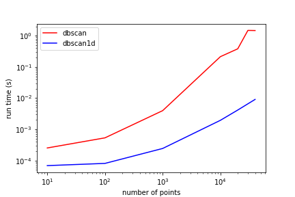

# DBSCAN1D
dbscan1d is a 1D implementation of the [DBSCAN algorithm](https://en.wikipedia.org/wiki/DBSCAN). It was created to efficiently
preform clustering on large 1D arrays. 

[Sci-kit Learn's DBSCAN implementation](https://scikit-learn.org/stable/modules/generated/sklearn.cluster.DBSCAN.html) does
not have a special case for 1D, where calculating the full distance matrix is wasteful. It is much better to simply sort
the input array and performing efficient bisects for finding closest points. Here are the results of running the simple
profile script included with the package. In every case DBSCAN1D is about 100x faster than scikit learn's implementation.

 

## Installation
Simply use pip to install dbscan1d:
```bash
pip install dbscan1d
```
It only requires numpy.

## Quickstart
dbscan1d is designed to be interchangable with sklearn's implementation in alnmost
all cases. The exception is that the `weights` parameter is not yet supported.
